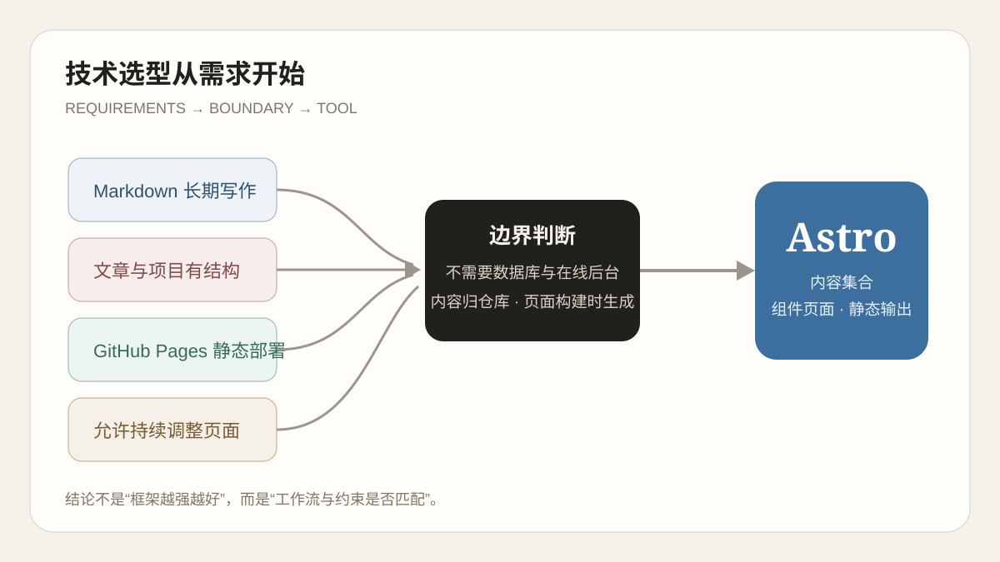

系列第一篇先说明这个站为什么存在，接下来就要回答一个更具体的问题：它应该用什么方式搭建。搭建个人博客时，最容易从“哪个主题好看”开始，接着在框架、插件和模板之间反复横跳。这个过程很像先挑了一套漂亮家具，回头才发现房间尺寸还没量。对我来说，更可靠的顺序是先确定这个站点要解决什么问题，再判断哪种技术能够以较低成本长期运行。

这个博客最初并不需要账号系统、后台管理或在线编辑器。它需要的是一个可以直接写 Markdown、能够保存项目材料、适合公开部署，同时又允许我继续调整页面结构的个人站。需求一旦说清楚，选型范围其实会迅速缩小。

*先固定需求和边界，再比较工具；框架名称应该出现在判断的后半段。*

## 先定义这个博客是什么

### 它首先是一套长期文件

文章和项目说明应该保存在仓库里，而不是只存在某个平台的数据库中。Markdown 可以被 Git 追踪，可以由 Obsidian 打开，也可以在未来迁移到其他生成器。即使站点页面暂时不能运行，正文仍然是普通文件，不会被锁进某个编辑器。

### 它需要明确的内容结构

这个站不只放随笔，还会放项目、系列复盘、标签、分类和少量站点记录。如果所有文件都只是松散 Markdown，时间久了就容易出现日期格式不一致、项目字段缺失和草稿意外公开的问题。因此，我希望构建工具能在生成页面前检查内容结构，而不是等上线后才从页面里发现错误。

### 它应该尽量静态

博客的大部分页面在发布前就可以确定。文章标题、正文、标签和目录没有必要每次访问都让服务器重新计算。静态输出既适合 GitHub Pages，也减少了数据库、服务进程和运行时升级等维护工作。

这不意味着“静态一定比动态先进”。它只意味着：当需求主要是公开阅读时，不引入长期运行的后端反而更贴合问题。

## 比较的不是框架，而是工作流

我把候选方向分成三类，而不是只比较几个热门名字。

| 方向 | 优点 | 对这个站的代价 |
| --- | --- | --- |
| 托管式写作平台 | 开箱即用，不需要部署 | 页面结构、数据导出和长期控制能力有限 |
| 主题型静态博客 | 文章体系和主题生态成熟 | 深度调整时需要理解主题约定与覆盖方式 |
| 组件型静态站点 | 页面结构自由，内容与组件可以分别管理 | 需要自己承担设计、组件和升级验证 |

Hexo 配合 Butterfly 属于成熟的主题型方案。后来研究 `Snows-Blog` 时，我确实从它的首屏、归档、侧栏和文章资源管理中学到了很多。但“值得借鉴”不等于“必须迁移”。这个站已经使用 Astro 建立了内容和组件边界，继续迁移会把时间花在重做路由、模板和插件配置上，而不是改善文章本身。

Astro 的吸引力也不是某个宣传口号，而是它刚好落在第三类：正文可以继续写 Markdown，页面可以使用组件组合，最终仍然输出静态文件。这样既保留了内容的朴素形式，又没有把视觉和交互限制在一个固定主题里。

## Astro 与当前需求如何对应

### Content Collections 负责内容契约

仓库中的文章并不是构建时随便扫描的文本。`src/content.config.ts` 使用 schema 定义标题、日期、标签、分类、系列、封面和草稿状态。构建过程会先检查这些字段，再交给页面渲染。它解决的是“内容能不能稳定进入系统”，而不仅是“Markdown 能不能转成 HTML”。

### 组件负责页面结构

导航、标题背景、左侧信息栏、目录、评论区和文章系列导航都可以作为独立组件维护。首页可以拥有全屏首图，时间轴和标签页使用较短的标题背景，文章详情则展示标题、日期和标签。它们共享整体风格，但不必强行使用同一套页面模板。

### 静态输出负责部署边界

`astro build` 生成最终页面，Pagefind 再根据构建产物制作搜索索引。GitHub Pages 只负责提供这些静态文件，不需要额外服务器。站点中的评论是一个明确的外部能力：只有读者主动点击后才连接 giscus，而不是为了评论功能把整个博客改造成动态应用。

## 选型仍然有成本

选择 Astro 并不等于后续不需要维护。版本升级可能调整 Markdown 配置和类型定义，GitHub Pages 的 `/yl-blog` 基础路径要求所有站内资源都正确加前缀，组件自由也意味着视觉一致性需要自己负责。

这些成本之所以可以接受，是因为它们都发生在构建和仓库范围内，能够通过测试与 Git 历史追踪。相较于维护数据库、服务器进程和在线后台，这更符合个人站点的规模。

> 合适的技术不是功能最多的技术，而是能让主要工作继续发生的技术。对这个站来说，主要工作始终是写作、整理和复盘。

## 从这次选型中学到什么

第一，技术选型应该从约束开始。部署平台、内容所有权、维护能力和写作习惯，比框架热度更能决定结果。

第二，成熟主题和自定义组件不是非此即彼。可以学习 Butterfly 的信息组织方式，同时继续使用 Astro 的内容模型和组件体系。借鉴设计思路，比复制整套实现更容易保留自己的结构。

第三，选型不是一次性结论。后续每次升级、构建和内容扩展都在重新验证它是否仍然合适。如果某一天这个站真的需要账号、在线协作或服务端数据，再讨论服务端方案也不迟；在那之前，不必提前给博客盖一座机房。

选型解决了“用什么搭”，却还没有解决“文章怎样变成稳定页面”。下一篇会继续拆开 Astro Content Collections，看看 Markdown、图片、标签和路由如何组成这个站的内容骨架。
