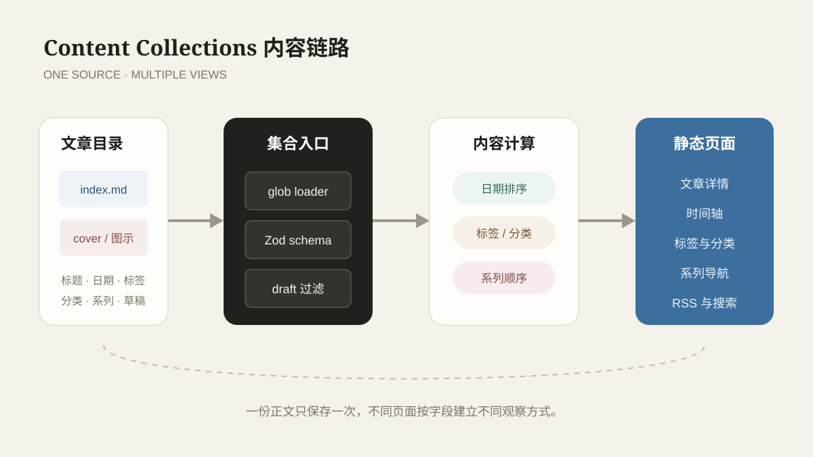

Astro 解决了技术框架问题，Content Collections 则负责让内容不至于越写越乱。博客刚开始只有一篇文章时，文件放在哪里似乎都没关系。等到文章、项目、标签和系列逐渐增加后，内容组织就会开始影响页面生成、搜索结果和后续维护。一个日期写错，时间轴可能整体错位；一个分类名称多出空格，分类页就会平白多出一个入口。

因此，这个站没有把 Markdown 当作“随便放进去就能显示的文本”，而是把它当作有结构的数据。Astro Content Collections 位于文件和页面之间，负责读取、检查和统一内容，再由路由与组件把这些数据变成页面。



*文件只是入口；真正稳定的内容流还包括 schema、过滤、排序、路由和索引。*

## 文件夹结构先表达内容边界

文章采用一个文件夹对应一篇内容的方式：

```text
src/content/posts/
└─ astro-content-collections/
   ├─ index.md
   └─ diagram.svg
```

`index.md` 保存正文和 frontmatter，同目录可以放文章独有的图。这样复制、移动或归档一篇文章时，资源不会散落到公共目录里。对于多个页面共享的站点素材，例如头像、首页背景和社交分享图，则放在 `public/` 中，由固定网址访问。

这种区分很简单：**文章资源跟着文章走，站点资源跟着整个站走。** 如果所有图片都堆在一个公共目录里，短期看起来方便，几年后只剩下一场“这张图到底是谁在用”的考古活动。

## schema 把约定变成检查

文章集合的字段在 `src/content.config.ts` 中统一定义：

```ts
z.object({
  title: z.string(),
  date: z.coerce.date(),
  tags: z.array(z.string()).default([]),
  category: z.string().optional(),
  series: z.string().optional(),
  seriesOrder: z.number().optional(),
  summary: z.string().optional(),
  cover: image().optional(),
  draft: z.boolean().default(false),
})
```

这里最重要的不是字段数量，而是每个字段都对应真实页面行为：

- `date` 决定时间轴和上一篇、下一篇的顺序；
- `tags` 形成标签页和文章之间的多对多关系；
- `category` 提供更稳定的单一内容归属；
- `series` 与 `seriesOrder` 组织连续阅读顺序；
- `cover` 供文章卡片使用，并由 Astro 校验本地图片；
- `draft` 决定内容能否进入公开构建。

如果只在文档里写“日期必须合法、草稿不能发布”，这仍然依赖每次人工记住。schema 则会在构建时执行相同规则，让约定成为流程的一部分。

## loader 决定哪些文件属于集合

文章 loader 使用 `glob` 查找 `src/content/posts` 下的 `**/index.md`。目录名会成为文章 ID，例如：

```text
src/content/posts/hello-world/index.md
→ hello-world
→ /posts/hello-world/
```

这种映射让文件路径、内容 ID 和网址之间保持稳定关系。标题以后可以修改，网址不必跟着中文标题变化。系列顺序也不依赖文件名排序，而由 `seriesOrder` 明确决定。

项目、相册和友链则使用不同集合。项目是独立 Markdown，适合保存状态、周期、技术栈和仓库链接；相册与友链使用 YAML，适合较短的结构化列表。Content Collections 并不要求所有数据长得一样，它提供的是“每类内容都有自己的契约”。

## 从集合生成多个阅读入口

`publishedPosts()` 是文章的统一公开入口。它先排除 `draft: true` 的内容，再按日期倒序返回结果。时间轴、首页最近文章和 RSS 直接使用这批公开文章；Pagefind 则只扫描它们生成后的公开页面，避免草稿从另一条入口混进搜索结果。

在此基础上，几个小函数负责不同视图：

1. `groupByYear()` 按年份组织时间轴；
2. `allTags()` 汇总标签并按文章数量排序；
3. `allCategories()` 生成分类和对应文章；
4. `allSeries()` 按 `seriesOrder` 生成连续阅读顺序。

这说明标签、分类和系列不是三种不同的文章副本，而是对同一集合的三种观察方式。正文只保存一次，页面根据字段建立不同索引。

## 路由负责把数据变成页面

文章详情页在构建阶段读取全部公开文章，为每个 ID 生成静态路径。渲染 Markdown 时，Astro 还会返回标题列表，页面只选取二级和三级标题作为目录。文章正文、目录、系列导航和上下篇因此都来自同一个内容对象。

标签和分类详情页采用类似方式：先收集所有标签或分类，再为每一项生成静态路径。新增一篇文章后，只要 frontmatter 合法，就不需要手动创建对应的标签页或年份页。

## 图片路径为什么要分清两种情况

同目录图片使用相对路径：

```md

```

Astro 能在构建时识别资源关系。公共素材则通过站点基础路径访问。由于 GitHub Pages 部署在 `/yl-blog` 下，直接写 `/avatar.png` 会指向域名根目录，而不是仓库站点。页面组件统一通过 `withBase()` 生成路径，避免本地开发正常、线上图片失踪的经典节目。

## 从内容建模中学到什么

第一，内容系统也需要类型。类型并不会让文章更有文采，但能阻止错误字段悄悄进入所有索引页面。

第二，单一事实来源比多个页面各自处理更可靠。公开文章统一经过 `publishedPosts()`，草稿过滤、时间排序和系列关系才不会在不同入口之间打架。

第三，目录结构本身就是设计。让一篇文章与自己的资源待在一起，能显著降低迁移和清理成本。真正好用的内容骨架不会在写作时频繁提醒自己的存在，却能在文章越来越多时继续保持秩序。

内容骨架稳定以后，下一步才是决定这些内容应该怎样被读到。首页、时间轴、标签页和文章详情承担不同任务，不能只换一个标题就当作四种页面。
