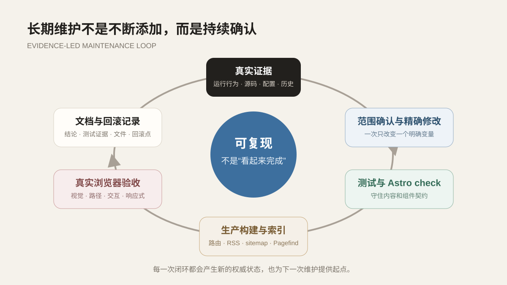

前六篇依次整理了建站目的、技术选型、内容骨架、阅读体验、功能集成和部署链路。博客第一次上线后，很容易产生“站已经搭完了”的错觉，接下来只要偶尔写文章，技术部分似乎可以永久封存。但真实情况恰好相反：依赖会升级，项目事实会补充，文章数量会增加，原先适合三篇内容的页面未必适合三十篇内容。

这个站从最初脚手架到现在，经历了首屏重做、导航收敛、目录调整、评论接入、依赖升级、文章分类拆分和多轮内容复核。很多改动不是增加新功能，而是让已有功能更符合现在的内容规模。

*维护不是不断添加，而是从证据出发修改，再回到构建产物和真实页面确认。*

## 先区分事实、设计和计划

项目文章最容易出现的问题不是错别字，而是把不同可信度的内容写在同一种语气里。例如，一个功能可能存在于当前源码中，也可能只出现在旧文档里，还可能只是未来想法。如果三者都写成“系统已经实现”，文章就会比代码更自信。

这个站在整理项目内容时采用的顺序是：

1. 当前运行行为和实际页面；
2. 当前源码、配置与构建产物；
3. 项目材料和 Git 历史；
4. 计划、注释和未完成设计。

越靠后的材料，越需要在文章中说明边界。团队项目中没有独立完成的部分，也不写成个人贡献，而是明确为后期源码阅读和技术学习。这样做不会让文章显得“没那么厉害”，反而能让读者知道哪些结论可以继续追溯。

## 精确修改比顺手重构更安全

博客的页面、测试和内容已经形成关联。修改一个分类字段会影响分类页、文章标题区、搜索索引和构建页面数量；调整一个基础路径可能同时影响图片、RSS 和评论映射。

因此，维护时尽量一次只改变一个明确变量：先确认当前状态，再修改目标文件，随后检查差异。看到相邻代码“不太顺眼”并不是顺便重构的理由。小范围改动更容易说明原因，也更容易在出错时回滚。

这套原则对内容同样有效。修正项目起始日期时，不应该顺便根据猜测重新分配所有文章日期；拆分文章分类时，也不需要同时重写标签。保持修改目的单一，时间轴变化才有清楚证据。

## 自动测试负责守住已确认规则

这个仓库的测试不只检查工具函数，也会读取页面和内容源，确认已经达成的设计决定仍然存在。例如：

- 文章系列顺序是否完整且不重复；
- 草稿是否被公开查询排除；
- 页面是否保留统一标题背景与左侧栏；
- 次要页面是否退出搜索和 sitemap；
- GitHub Pages 图片路径是否保留基础前缀；
- 项目文章是否按真实项目名称分类。

这类测试不是为了追求覆盖率数字，而是把“之前为什么这样改”变成可执行约束。未来修改页面时，如果某项确认过的结构被误删，测试会比肉眼翻完所有页面更早提醒。

当然，源码字符串测试也有边界。它能证明组件仍然包含某段逻辑，不能证明页面在浏览器里真的好看。自动测试守住契约，视觉验收检查结果，两者需要配合。

## 构建与浏览器验收回答不同问题

一次正式改动通常至少经过四层验证：

### 内容与单元测试

检查字段、排序、过滤和关键页面约束。它适合快速定位“哪条规则被破坏”。

### Astro check

检查内容 schema、组件类型和模板语法。Markdown 能读不代表 frontmatter 一定符合集合定义，这一步负责在生成页面前拦住结构错误。

### 生产构建

生成所有静态路由、RSS、sitemap 和 Pagefind 索引。页面数量和索引数量的变化也能提供线索：新增六篇文章后，文章详情、标签和系列入口都可能增加。

### 真实浏览器验收

检查桌面与移动端、亮暗主题、目录高亮、搜索跳转和评论加载。浏览器显示的是组合后的最终行为，尤其适合发现溢出、遮挡和路径错误。

> “测试通过”和“页面可用”不是同一句话。前者是证据的一部分，后者需要多层证据共同支持。

## 依赖升级需要单独验证

站点已经经历过 Astro 版本升级和依赖安全清理。升级前先运行漏洞扫描并记录结果，升级后再执行类型检查、测试与生产构建。版本号变大不代表问题自动消失，lockfile、实际解析版本和构建行为才是检查对象。

对于个人站，依赖数量越少，长期维护面通常越小。这个项目没有为了一个简单按钮引入完整组件库，也没有为静态页面增加后端框架。减少依赖不是拒绝工具，而是让每个依赖都能说清楚用途。

## 文档和进度记录为什么还要保留

Git 提交能说明哪些行发生变化，却不一定说明当时如何验证、哪些事项明确搁置。正式设计与当前状态放在 `docs/`，每轮实际施工则在 `progress.md` 末尾追加完成内容、测试证据、文件清单和回滚方式。

这份记录对长期项目很有价值。几个月后再次处理评论、相册或部署问题时，可以先确认哪些事情已经验证，哪些因为缺少素材而暂停，不必把旧问题重新表演一遍。

## 从长期维护中学到什么

第一，博客也是软件，只是业务对象变成了文章、标签和阅读体验。内容错误、路径错误和依赖错误都会直接影响公开结果。

第二，维护工作的核心不是“持续改”，而是“持续确认”。有些功能应该增强，有些应该删除，还有些在素材和需求不足时应该保持搁置。

第三，完成标准必须落到权威表面。源码、测试、构建和浏览器分别提供不同证据；只有它们能够连成一条可复现链路，才适合说这轮工作真正结束。

站点建设系列写到这里，也并不意味着这个博客从此定型。更准确地说，它终于拥有了一套能够继续变化、又不至于每次从头猜测的维护方法。
