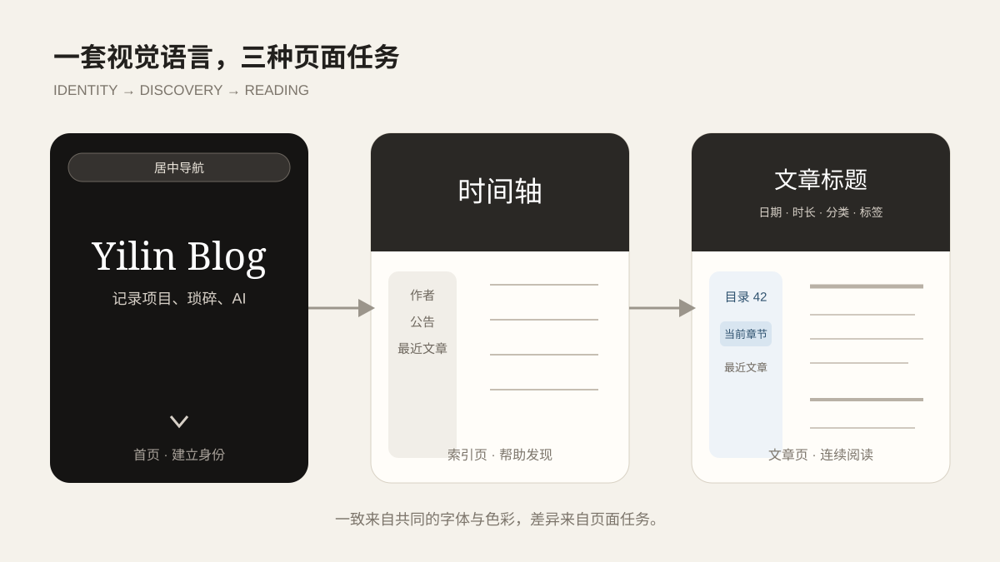

内容能够稳定生成后，问题就从“页面有没有”变成了“读起来是否连贯”。个人博客很容易出现两种极端：一种是首页做得很热闹，进入文章后像换了一个网站；另一种是所有页面完全相同，首页、归档和正文只剩标题不同。这个站的调整过程主要在寻找中间位置：保留统一的墨色背景、字体和卡片语言，同时让不同页面承担不同任务。

首页要回答“这是什么站”，时间轴与标签页要回答“内容在哪里”，文章详情要回答“怎样顺利读完”。当这些页面关系清楚以后，视觉才不只是装饰，而是在帮助读者判断自己当前的位置。

*不同页面使用同一套视觉语言，但首屏高度、信息密度和交互重点并不相同。*

## 首页只把第一件事说清楚

首页使用全屏主视觉，中央只保留站点名称和循环打字的一行说明。向下滚动或点击箭头后，页面直接进入内容区域，不让首屏与第二屏长时间混在同一视口里。

这项设计并不是为了让首页“像某个主题”，而是为了减少第一屏的信息竞争。早期页面曾同时放标题、长说明、标签和多个按钮，所有元素都在强调自己，结果反而没有真正的重点。删去多余按钮和说明后，首屏只负责建立身份，具体内容交给下一屏。

固定导航在首屏上方保持透明，离开主视觉后恢复卡片背景。导航没有换位置，但会根据背景改变承载方式：在大图上尽量轻，在正文上保证可读。移动端则折叠为菜单，避免把七八个入口压成一行微型字。

## 内容索引使用较短的标题背景

时间轴、标签、分类和关于页不需要再次占满一整个屏幕，但仍需要清楚的页面边界。因此它们共用 `PageTitleHero`：沿用首页背景和暗色遮罩，将高度控制在约 380 到 500 像素之间，中央只显示当前页面标题。

这层标题背景有两个作用：

1. 保持从首页进入内页时的视觉连续性；
2. 给固定导航留下稳定、对比明确的顶部区域。

背景之后才进入两栏内容。左侧统一展示头像、公告、最近三篇文章和站点信息，右侧根据页面类型显示时间轴、标签云、分类列表或关于说明。左侧不是为了把个人资料重复六遍，而是提供稳定的站点坐标。

## 文章页需要不同的标题层级

文章详情使用 `ArticleTitleHero`。同一张背景上除了文章标题，还显示发布日期、阅读时长、分类和标签。这里信息更多，是因为读者需要在进入正文前判断文章主题和阅读成本。

标题背景之后，页面进入真正的阅读区：

- 左侧先出现作者信息和公告；
- 再往下是可以停驻的目录、最近文章和站点统计；
- 右侧始终是正文与系列导航；
- 评论区位于正文所在列的底部，而不是被塞进侧栏。

目录和正文并排存在，使读者不必在长文中反复滚到顶部确认结构。侧栏也没有从页面一开始就整体固定，否则较高的作者卡片会占住视口。只有阅读工具区域进入合适位置后才使用 `sticky`，让“停住的东西”恰好是当前真正需要的东西。

## 目录不是一串普通锚点

Astro 渲染文章时会返回标题数据。页面提取二级和三级标题生成目录，并为不同层级设置缩进。浏览器通过 `IntersectionObserver` 和标题位置判断当前章节，目录高亮会跟随正文变化。

右上角的数字也不是页码。网页没有固定纸张，窗口高度和字体大小变化都会改变“页数”。这里显示的是文章阅读进度百分比，根据正文起点、正文高度和当前滚动位置计算。它回答的是“还剩多少”，而不是假装网页被切成了第 38 页。

移动端没有足够宽度让目录与正文并排，于是目录变成固定按钮和抽屉。打开后可以跳转章节，按 `Escape` 关闭，关闭时焦点回到原按钮。响应式设计不只是把两列改成一列，还要重新安排交互顺序。

## 动效需要知道什么时候退场

首页的平滑滚动、循环打字、背景切换和全站羽毛效果都提供动态反馈，但系统设置为减少动态效果时，页面会停用或简化这些动画。目录跳转也会尊重这一偏好。

这让我逐渐理解，动效的价值不是证明页面“会动”，而是帮助表达状态变化。首屏文字循环用于说明站点内容范围，导航背景变化用于提示已经离开大图，目录高亮用于定位章节。没有信息作用的动画越多，读者越难分辨真正的反馈。

## 从 Butterfly 参考中保留什么

研究 `Snows-Blog` 和 Butterfly 时，我重点观察了全屏首图、归档入口、侧栏卡片和文章目录。最后保留的是这些设计背后的信息关系，而不是整套主题结构。

例如，首页仍然使用当前站点自己的墨色主视觉；侧栏没有照搬全部小组件，只保留作者卡、公告、最近文章和统计；文章目录使用 Astro 的标题数据和当前组件实现。这样既借到了成熟博客的阅读经验，也没有把现有站点重新包装成另一个主题的复制品。

## 从页面设计中学到什么

第一，页面一致不等于页面相同。首页、索引页和文章页共享颜色与字体，但它们的信息密度应该由任务决定。

第二，删除也是设计。首屏真正变清楚，不是因为又加了一个特效，而是因为移除了长说明、标签和多余按钮。

第三，侧栏、目录和正文必须一起考虑。单独看一个卡片很好看，不代表放进完整页面后仍然好用。布局设计最终要接受真实长文、窄屏和滚动过程的检验，而不是只在第一张截图里表现良好。

阅读结构确定以后，搜索、订阅、评论和分享才有合适的落点。下一篇不再继续增加视觉元素，而是说明这些能力分别发生在构建期、页面期还是读者主动连接时。
