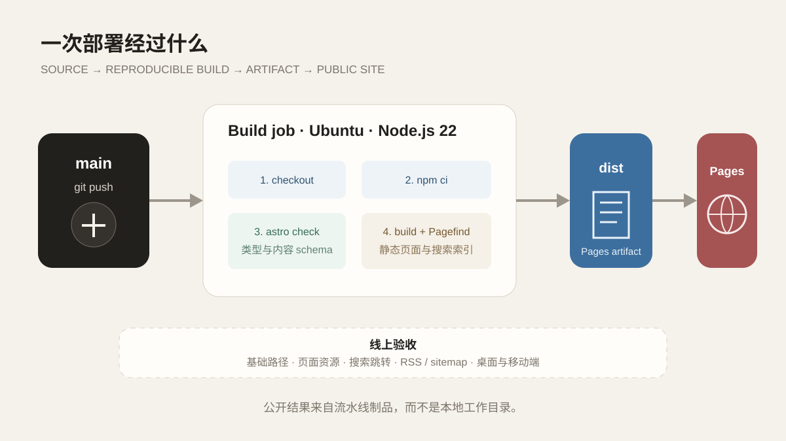

搜索、RSS 和评论入口在本地都能写出来，但只有跟随构建产物发布后，读者才能真正访问它们。本地执行 `npm run dev` 后能够打开页面，只能证明开发服务器在当前电脑上运行。公开站点还要经历依赖安装、类型检查、静态构建、搜索索引、制品上传和 GitHub Pages 发布。任何一步与本地环境不一致，都可能出现“我这里明明没问题”的经典场面。

因此，这个站把部署写成仓库内的 GitHub Actions Workflow。每次 `main` 分支更新后，GitHub 使用固定步骤重新构建，而不是把本地 `dist/` 目录直接提交上去。



*线上页面来自可重复执行的流水线，不来自某台电脑上一次偶然成功的构建。*

## 先固定站点地址和基础路径

GitHub Pages 的公开地址是：

```text
https://jaychouhyl.github.io/yl-blog/
```

这意味着站点不位于域名根目录，而是在 `/yl-blog` 子路径中。Astro 配置因此明确写出：

```js
defineConfig({
  site: 'https://jaychouhyl.github.io',
  base: '/yl-blog',
  trailingSlash: 'always',
})
```

`site` 用于生成完整网址，`base` 决定页面和资源前缀，`trailingSlash` 让路由输出保持统一。组件中的站内链接通过 `withBase()` 加前缀，避免把 `/posts/` 错误地解析成 `https://jaychouhyl.github.io/posts/`。

基础路径是这个站早期最值得记住的部署知识之一。本地开发服务器通常会替你处理很多路径细节，真正放到子目录后，图片、搜索脚本、RSS 和导航链接才会一起接受考试，而且它们往往不会提前互相通气。

## Workflow 的构建阶段

当前 Workflow 在 `main` 分支推送或手动触发时运行。构建 job 使用 Ubuntu 和 Node.js 22，步骤保持得很短：

```yaml
- uses: actions/checkout@v4
- uses: actions/setup-node@v4
  with:
    node-version: 22
    cache: npm
- run: npm ci
- run: npm run build
- uses: actions/upload-pages-artifact@v3
  with:
    path: dist
```

`npm ci` 严格依据 lockfile 安装依赖，避免 Workflow 自行更新版本。`npm run build` 又依次执行 Astro 类型检查、静态构建和 Pagefind 索引。只要其中一步失败，`dist` 就不会被当作可发布制品上传。

这条链路没有为了显得“像企业流水线”而增加很多阶段。个人站需要的是明确而可重复，而不是十几个颜色不同但都在执行 `npm install` 的方框。

## 制品与部署为什么分成两个 job

构建 job 只需要读取仓库，完成后上传 Pages artifact。部署 job 依赖构建成功，再获得 `pages: write` 和 `id-token: write` 权限，把制品发布到 GitHub Pages 环境。

将二者分开有两个好处：

1. 构建阶段不需要发布权限；
2. 发布对象是已经完成的静态制品，而不是正在变化的工作目录。

Workflow 还配置了同一 Pages 组的并发控制。新的提交到来时，可以取消仍在进行的旧部署，避免较早版本在更晚时间覆盖新版本。

## 本地验证要尽量模拟生产

开发服务器适合快速写作和调整样式，完整验收则需要至少经过下面几层：

1. `npm test`：检查文章系列、页面结构和关键配置约束；
2. `npm run check`：先快速验证 Astro 与 TypeScript；
3. `npm run build`：再次执行检查，并生成全部静态页面和 Pagefind 索引；
4. `npm run preview`：用构建产物而不是源文件启动本地预览；
5. 链接检查与浏览器验收：确认基础路径、搜索、目录和响应式行为。

这些验证不能互相替代。单元测试通过不代表图片路径正确，构建成功不代表移动端目录好用，浏览器里看起来正常也不代表草稿没有进入 RSS。每一层都在回答不同问题。

## 发布后的权威结果在哪里

GitHub Actions 显示成功说明 Workflow 完成了部署，但最终仍要访问线上地址确认。浏览器实际收到的 HTML、图片和搜索文件，才是公开用户面对的状态。

验收时重点检查：

- 首页和内页是否都带 `/yl-blog` 路径；
- 导航、文章图片和搜索结果跳转是否正确；
- RSS、sitemap 和社交分享图是否使用完整公开网址；
- 评论区是否在点击后加载；
- 手机宽度下是否切换为单列布局。

如果本地与线上冲突，应先查看 Actions 日志和线上响应，而不是默认源码一定正确。源码说明“准备怎样运行”，构建产物和线上页面才说明“现在实际怎样运行”。

## 从部署中学到什么

第一，部署不是 `git push` 的别名。推送只交付源代码，流水线负责把它转换成可公开访问的制品。

第二，可复现比手工熟练更重要。某次在本地成功复制文件不难，难的是一个月后仍能用相同步骤得到相同结构。

第三，最小权限和分阶段并不是大型系统专属。即使只是个人博客，把只读构建与带发布权限的部署分开，也能让边界更容易理解和检查。

部署成功不是建设工作的终点。文章会增加，依赖会升级，原先正确的路径和页面规则也可能被后续修改破坏，因此最后一篇会把测试、浏览器验收和过程记录整理成长期维护闭环。
