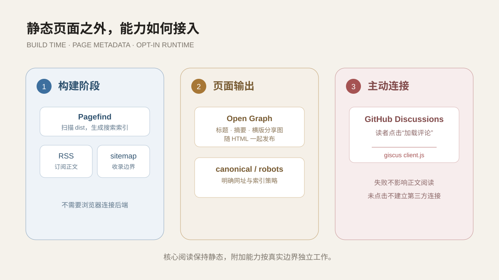

页面结构稳定后，站点还需要补上发现、订阅和交流入口。“静态博客”听起来像一叠不会变化的页面，但实际使用时，读者仍然需要搜索、订阅、评论和分享。这些能力不一定要求博客拥有自己的服务器。更重要的问题是：每项能力应该在哪个阶段完成，它依赖什么数据，以及失败时会不会拖垮正文阅读。

这个站把能力分成三层：构建阶段生成搜索和索引文件，页面元数据直接写入静态 HTML，评论则保留为读者主动连接的外部服务。三层职责不同，维护方式也不同。



*搜索、订阅、分享和评论都能服务阅读，但并不需要被塞进同一种运行模型。*

## Pagefind：在构建产物上建立搜索

Astro 先把 Markdown 和页面组件生成到 `dist/`，随后 Pagefind 扫描这些最终 HTML，提取标题与正文并生成静态搜索索引。构建命令因此不是单独的 `astro build`，而是：

```json
"build": "astro check && astro build && pagefind --site dist"
```

这个顺序非常重要。Pagefind 搜索的是读者最终能看到的页面，而不是源文件目录。草稿没有被 Astro 生成，自然也不会进入搜索；标记为不参与搜索的辅助区域和次要页面，同样可以被排除。

搜索弹窗不会在首次加载页面时立即下载全部 UI 资源。读者点击搜索按钮或按下 `Ctrl+K` 后，页面才加载 `/pagefind/pagefind-ui.js` 和对应样式。开发服务器没有生成 Pagefind 索引，因此本地 `npm run dev` 只能验证弹窗本身；真实搜索要经过 `npm run build` 和预览环境验证。

这件小事提醒我：**开发模式能打开页面，不代表构建期功能已经被验证。** 搜索属于最终产物能力，测试入口也应该放在最终产物上。

## RSS：把公开文章变成订阅流

RSS 路由读取 `publishedPosts()`，因此它与时间轴和首页使用同一批公开内容。每一项包含标题、发布日期、摘要、文章链接和由 Markdown 转换的正文 HTML。

为了避免正文中的原始 HTML 被直接带入订阅器，RSS 渲染时会丢弃原始 HTML，只处理 Markdown 内容。它并不能解决所有内容安全问题，但明确了一个边界：订阅输出不是简单复制源文件，而是一次单独的格式转换。

RSS 的价值不在于站点必须显眼地摆一个橙色图标。它提供的是一种平台无关的订阅方式：读者可以在自己的阅读器里跟踪更新，文章也不必依赖某个社交平台的推荐流才能被发现。

## sitemap、canonical 与收录边界

`astro.config.mjs` 配置站点地址、`/yl-blog` 基础路径和统一尾斜杠，并由 sitemap 集成生成索引。相册、友链和标签关系图属于保留功能，但不是当前需要推广的正式入口，因此不会进入 sitemap，页面本身也设置 `noindex` 并退出 Pagefind 搜索。

每个正式页面还输出 canonical URL，避免同一内容因为路径写法不同被当作多个地址。这里的重点不是堆满 SEO 字段，而是让“公开”和“可收录”成为两个可以分别控制的状态。

## Giscus：评论是一条主动连接

评论由 GitHub Discussions 和 giscus 提供，使用当前页面路径映射讨论。这样不需要单独维护评论数据库，身份与讨论记录也由 GitHub 承担。

但外部评论脚本不会随着正文自动加载。文章底部先显示说明和“加载评论”按钮，只有读者点击后才插入 `https://giscus.app/client.js`。加载失败时，正文、目录和站内导航仍然可以正常使用，按钮会允许重试。

这种处理有两个原因：

1. 不阅读评论的人不必建立第三方连接；
2. 外部服务暂时不可用时，核心阅读链路不应一起失败。

静态站并没有消灭运行时依赖，只是把依赖从“页面必须依靠它运行”降为“某项附加能力在需要时连接”。

## 社交分享图与浏览器图标不是同一张图

浏览器标签页图标需要在很小的尺寸里辨认，因此直接使用方形头像。社交平台抓取链接时则需要横版预览，站点使用独立的 1200×630 `social-cover.png`，保留首页墨色背景、站点名称和说明。

`BaseLayout` 为页面输出 Open Graph 和 Twitter Card 元数据，图片网址同样通过站点基础路径生成。当前所有文章共用站点默认分享图，这是成本较低且视觉一致的方案；以后如果某篇文章确实需要专属封面，再扩展文章级元数据也不迟。

## 这些能力为什么不做成一个“大插件”

搜索、RSS、评论和分享预览看起来都属于“博客功能”，但它们发生在不同阶段：

- Pagefind 在构建后处理最终 HTML；
- RSS 和 sitemap 在构建时生成文件；
- Open Graph 元数据直接存在于页面 `<head>`；
- giscus 在浏览器中由用户触发。

如果用一个抽象把它们强行包在一起，配置表可能更整齐，真实边界反而更模糊。现在每项能力都保留最小实现，出现问题时也能快速判断应该检查源内容、构建产物还是外部请求。

## 从集成过程中学到什么

第一，静态与动态不是非黑即白。一个站可以让核心内容完全静态，同时为评论保留可控的动态连接。

第二，附加能力应该允许独立失败。搜索索引缺失时给出明确提示，评论加载失败时允许重试，但两者都不能阻止文章显示。

第三，隐私和性能往往指向同一个简单方案：延迟加载非必要的第三方脚本。少发一个请求，有时比再写一页隐私说明更直接。

这些功能最终都要进入同一份静态构建产物。下一篇会沿着这份产物继续向外走，说明本地代码怎样经过 GitHub Actions 变成公开可访问的 GitHub Pages 页面。
