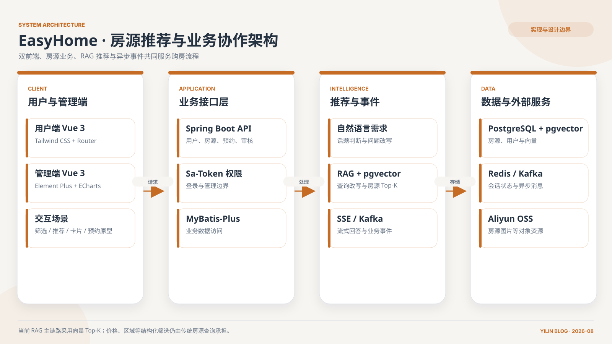

## 摘要

EasyHome 是一个团队完成的二手房推荐系统，项目周期为 2025 年 6 月 22 日至 8 月 12 日。它希望把传统的价格、面积、户型筛选扩展为自然语言交互：用户可以描述“通勤方便、环境安静、预算有限”这类难以被固定字段完整表达的需求，系统再结合房源知识库检索相关信息，并生成带推荐理由的回答。

我直接参与的是管理端前端、部分 UI 设计以及技术报告和展示材料。公开仓库中以我账号提交的代码也集中在 `admin-web`，包括后台基础结构、用户管理、房源管理、房源审核、预约管理、登录和设置等页面。用户端、RAG 后端和 SSE 流式链路是团队整体成果，本文对它们的分析来自后期阅读代码、整理技术报告和复盘系统架构，不写成我独立完成的模块。

## 架构总览



*架构图：依据用户端、管理端、Spring Boot 业务接口、RAG、SSE、Kafka、PostgreSQL/pgvector、Redis 与对象存储实现整理。图中同时保留了当前向量 Top-K 与传统结构化筛选的职责边界。*

## 1. 我直接参与的管理端工作

房产推荐系统不能只有面向用户的对话页面。房源从发布到可推荐之前，还需要管理员审核；用户、预约和房源状态也需要稳定的后台入口。因此我参与搭建了管理端前端，并围绕以下页面持续调整：

- 管理员登录、个人资料和设置；
- 用户列表与用户状态管理；
- 房源信息管理；
- 用户发布房源的审核；
- 预约记录和处理状态；
- 后台 Dashboard 与导航结构。

管理端使用 Vue 3、TypeScript 和 Element Plus。相比用户端追求直观浏览，后台更在意信息密度、筛选效率、状态识别和操作反馈。一个审核按钮看起来很小，背后却需要明确当前房源处于什么状态、操作是否可逆、失败时如何提示，以及列表如何及时同步结果。

项目早期的页面更接近功能原型，我参与的后续优化重点是让不同管理页面拥有一致的布局、表格、表单和操作入口。这段工作后来也影响了我在 SmartX ERP 中对企业后台设计系统的理解。

## 2. 为什么自然语言适合补充传统房源筛选

传统筛选器适合处理价格、面积、户型和区域等结构化条件，却很难直接表达“适合居家办公”“老人出行方便”“晚上比较安静”等软性需求。LLM 的价值在于理解这些自然语言意图，但模型不能凭空知道当前有哪些真实房源。

RAG 在这里承担了一条连接链路：先理解和改写用户问题，再从房源数据与通用知识中检索相关内容，最后把检索结果作为上下文交给模型生成回答。这样可以减少模型完全依赖参数记忆的问题，也让推荐理由有机会回到具体房源信息。

项目后期代码中的大致流程是：

```text
用户问题与对话历史
→ 查询改写
→ Embedding 向量化
→ 房源向量相似度检索
→ 检索结果进入模型上下文
→ SSE 流式返回回答
```

这条链路是我通过代码和文档复盘理解的团队实现，不属于我的独立后端贡献。

## 3. 后期复盘中理解的技术架构

当前仓库由用户端 `web`、管理端 `admin-web` 和 Spring Boot 后端组成。用户端采用 Vue 3、TypeScript 和 Tailwind CSS，管理端采用 Vue 3、TypeScript 和 Element Plus。后端使用 Spring Boot 与 MyBatis-Plus 组织业务数据，PostgreSQL 保存房源、用户和预约等信息，pgvector 保存并检索向量，Redis 承担登录状态或缓存，Kafka 处理部分异步任务。

在 AI 链路中，后端需要同时面对结构化房源字段和自然语言描述。结构化数据适合精确筛选，向量检索适合寻找语义相近的房源。当前代码中的 RAG 查询主要先改写问题，再通过 pgvector 取得向量距离最近的房源 ID；价格、面积和区域等筛选另有普通列表查询入口，尚未与向量 Top-K 合并成同一条推荐管线。这也成为我复盘后最明确的改进认识：硬条件不能只交给提示词，应该在召回阶段进入确定性查询。

这让我认识到，所谓“AI 推荐系统”不是把一个聊天接口放到房源列表旁边。它至少需要处理数据质量、向量更新、会话历史、查询改写、召回范围、模型输出、推荐卡片和后续业务动作。任何一层没有接好，用户都会感受到回答与实际房源之间的断裂。

## 4. SSE 改变的是等待体验，不是结果可信度

系统使用 SSE 将回答逐步返回前端。流式输出可以让用户尽早看到结果，减少长时间空白等待，也便于前端区分开始、内容、结束和错误状态。但 SSE 只解决“回答如何抵达页面”，不会自动保证回答正确。

要让流式回答真正可用，前端仍需处理增量拼接、重复片段、异常中断、重新提问和页面状态恢复。如果回答中包含房源，理想状态还应将文本与房源卡片关联起来，让用户可以继续查看详情、收藏或预约，而不是读完一段文字后重新搜索。

我没有把 SSE 后端写成自己的直接贡献，但通过项目文档和代码复盘，我理解了流式协议与产品体验的关系：协议只是传输方式，真正的产品闭环仍然取决于回答能否连接到业务对象。

## 5. 管理后台让我看到 AI 产品的另一面

对话推荐是最容易被展示的部分，管理后台却决定了房源数据是否能够持续维护。管理员审核房源、处理预约和管理用户，看起来与 LLM 无关，实际上为推荐系统提供了可信的数据入口和业务状态。

如果未经审核的房源直接进入向量库，模型可能推荐无效内容；如果房源下架后向量没有同步删除，回答会继续引用过期信息；如果预约状态没有稳定管理，推荐带来的下一步动作也无法闭环。因此 AI 产品仍然需要传统后台工程，甚至更需要清楚的数据生命周期。

这也是我在后期复盘中最重要的认识：模型能力位于系统中间，而不是系统全部。前面需要可靠的数据采集和审核，后面需要详情、收藏、预约与通知。前端既要展示模型回答，也要把回答重新接回确定性的业务流程。

## 6. 团队协作与项目收获

项目材料记录的分工中，我参与 UI 设计、前端和文档展示，RAG 技术及主要后端由其他成员负责。公开说明时把这条边界写清楚，比笼统地宣称“完成了 LLM + RAG 系统”更有意义。

我从直接完成的管理端工作中学习了后台信息组织、审核流程和状态反馈；从后期复盘中理解了 Spring Boot、pgvector、Kafka、RAG 和 SSE 如何共同支撑一个 AI 推荐产品。两类收获性质不同，但都属于这段项目经历：前者是实际编码与联调，后者是对团队系统进行重新阅读后形成的工程认识。

## 说明边界

- EasyHome 是团队项目，不把用户端、后端和 RAG 全部归为个人成果。
- 管理端前端、部分 UI 设计和项目文档属于我的直接参与范围。
- RAG、向量检索、Kafka 与 SSE 的说明属于后期代码和架构复盘。
- 项目设计材料中的响应时间、同步延迟和推荐效果属于目标，不作为已完成性能验收的数据。

## 系列导读

建议按“管理后台 → 自然语言需求 → RAG 推荐 → SSE/Kafka”的顺序阅读：先理解房源、审核和预约这些确定性业务对象，再进入语言理解、向量召回与异步链路。这样不容易把 AI 功能误看成脱离业务数据的独立聊天窗口。

- [从管理后台理解业务状态与前端结构](../../posts/easyhome-admin-frontend/)
- [自然语言购房需求如何变成可执行条件](../../posts/easyhome-natural-language-requirements/)
- [RAG 与 pgvector 如何参与房源推荐](../../posts/easyhome-rag-recommendation/)
- [SSE 与 Kafka 分别解决什么问题](../../posts/easyhome-sse-kafka/)
- [查看完整 EasyHome 工程复盘系列](../../series/EasyHome%20工程复盘/)
