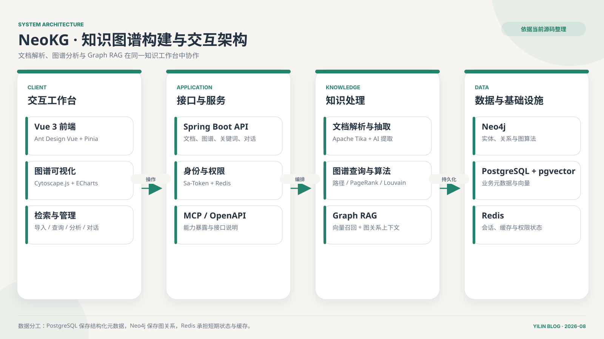

## 摘要

NeoKG 是一个团队完成的知识图谱构建与管理平台，项目周期为 2025 年 9 月 1 日至 10 月 23 日。系统围绕“把文档中的知识关系变成可以查询和理解的图”展开：系统提供文档—关键词导入和元模型实体关系抽取两类路径，前端再通过文档管理、关键词管理、图谱查询、路径搜索、社区发现和智能问答等入口组织这些能力。两条导入路径的保存对象与同步方式不同，不能把它们当成一条自动完成所有步骤的流水线。

我在项目中直接参与的部分主要是 Vue 前端、TypeScript 迁移、页面结构、图谱交互、查询功能和部分前后端联调。Spring Boot 后端、文档解析、向量检索和图谱存储是团队共同成果或其他成员主要负责的部分。本文对这些后端技术的讨论来自项目完成后的代码阅读、接口联调和架构复盘，不把它们写成我独立实现的成果。

## 架构总览

*架构图：依据源码版本 `3a5a380` 整理系统分层，不代表一次上传会依次执行全部模块。查询页使用 ECharts；问答以 Top-1 文档召回和一跳关键词关系组织上下文。具体导入分支见下文，图示不作为服务运行或性能验收记录。*

## 1. 我直接参与的工作

公开仓库的提交记录和本地实训材料可以相互印证，我直接参与的工作包括：

- 搭建前端基础布局，并将原有结构迁移到 Vue 3 + TypeScript；
- 完善上传、文档、关键词、查询和设置等页面；
- 增加登录、注册和 AI 问答界面；
- 处理暗色模式、路由、跨域和接口参数联调；
- 完善路径搜索、路径高亮和社区发现的前端交互；
- 调整图谱查询节点输入、结果展示和异常状态。

这部分工作看起来集中在“页面”，实际需要不断理解后端返回的节点、边、路径和社区数据。图谱前端无法只依靠静态原型完成，接口中的节点标识、方向、层级和算法结果都会直接影响页面如何渲染。

## 2. 图谱可视化：能画出来不等于能看懂

知识图谱天然适合使用节点和边展示关系，但节点数量一多，画面很快就会变成一团线。所读版本的查询页实际使用 ECharts 的 Graph 系列与力导向布局。虽然依赖清单中也有 Cytoscape.js，但依赖存在不等于当前页面使用了它。真正影响可读性的，是布局、密度、方向、筛选、高亮和上下文，而不是库的名字。

项目中的查询页面需要支持普通节点检索、路径搜索和社区发现。三类结果不能使用完全相同的视觉策略：

- 普通查询更重视目标节点及其直接邻居；
- 路径搜索更重视起点、终点和中间链路；
- 社区发现更重视分组差异和群体结构。

我在联调过程中遇到过路径返回参数不完整、中文参数处理、节点没有正确高亮和暗色模式下对比度不足等问题。它们让我意识到，图谱可视化不是后端数据的被动投影。前端必须理解当前任务是什么，再决定哪些节点突出、哪些关系弱化、用户下一步还能做什么。

## 3. 一条文档如何变成知识图谱

后期复盘代码时，我发现“文档入图”至少要拆成两条路径理解：

| 入口与用途 | 保存什么 | 怎样进入图数据库 |
|---|---|---|
| 文档上传：整理文档与关键词 | 模型整理出的文档、文档正文向量、关键词和文档—关键词关联 | 另有文档图同步入口；保存文档不等于图已同步 |
| 元模型上传：按所选实体与关系类型抽取 | 实体实例与关系实例 | 保存关系表后调用图同步服务 |

第一条解决“哪些文档与哪些关键词相关”，第二条解决“按指定结构抽取哪些实体和关系”。它们共享部分解析与存储能力，却不是同一条自动串联的业务链路。上传接口对格式的支持也不相同，不能只看 Tika 的能力列表就认为每个入口都支持 PDF。

后端使用 Spring Boot 组织接口和业务逻辑，Apache Tika 负责从文档中提取文本；PostgreSQL 保存元数据及适合关系表表达的数据，Neo4j 保存节点、关系和路径，Redis 承担缓存或会话类状态。模型能力用于从非结构化文本中抽取实体与关系，并为问答与语义检索提供补充。

这种混合存储不是为了堆叠数据库。关系型数据库适合保存结构明确、需要稳定约束的数据；Neo4j 更适合回答“两个实体之间经过哪些关系”“哪些节点属于同一社区”等问题。向量检索解决语义相近，图查询解决结构关联，两者关注的是不同维度。

另一个重要收获是：**写入两个数据库，并不等于得到一个跨库事务**。元模型路径先保存关系表，再调用 Neo4j 同步；这段代码仍需要分别考虑身份映射和失败后的数据对齐。这里讨论的是源码中的一致性边界，不把静态风险写成已经复现的线上故障。

## 4. 路径搜索与社区发现让我理解了图算法的产品价值

路径搜索、PageRank 和 Louvain 社区发现如果只出现在技术栈列表里，很容易变成展示性名词。把它们接进页面后，它们才开始对应真实问题：两个实体之间如何关联，哪些节点更关键，复杂网络中是否存在自然形成的群体。

项目界面和接口把路径功能称为“BFS 路径搜索”，后端实际查询则由 Cypher 沿文档—关键词关系进行无向匹配，深度限制为 1–100 跳，再按路径长度排序并取第一条。它与无权图最短路径的目标一致，但不应写成我在后端手写了一套 BFS；我更关注的是如何接入结果，并借此补齐 BFS、带权路径和查询约束之间的区别。

前端需要把算法结果转化为可操作信息。路径搜索应该明确起点、终点和每一步关系；社区发现应该让不同分组具有稳定区分，同时保留继续查看节点详情的能力；关键节点分析则不能只给一个分数，还需要放回原图中解释它为何重要。

这段经历让我形成了一个判断：图算法的价值不在于“系统支持多少种算法”，而在于算法结果能否帮助用户缩小问题范围。不能被解释和继续操作的结果，最多只是一次演示。

## 5. 图谱与 RAG 为什么需要彼此补充

项目后期加入了智能问答入口。它让我理解到：文本向量寻找语义接近的材料，图查询补充材料周围的关联信息，但两者如何组合，必须落实到具体代码，不能只写一个 Graph RAG 的名字。

所读版本的问答链路可以分为四步：

1. 把用户问题转换为向量，按 L2 距离从文档中召回最近的 **1 篇**；这段查询没有相关性阈值，最近不一定足够相关。
2. 使用召回文档的 ID，查找它直接连接的关键词，得到**一跳文档—关键词子图**，而不是任意实体的多跳推理结果。
3. 把文档正文、图关系和历史消息一起放进提示词，交给模型生成回答。
4. 通过 SSE 把回答文本逐段发送给前端；当前链路没有把结构化引用或可点击图证据作为独立事件返回。

因此，“图数据进入提示词”和“读者能点击引用核对答案”是两件事。后者需要另外设计证据标识、返回结构与前端动作，属于可以改进的方向，不是这里已经实现的功能。图谱给回答增加了上下文，但还不能顺便替它开一张“事实保证书”。

这部分后端能力来自团队成果。通过后期阅读，我更看重的收获是检索边界与接口契约：召回多少材料、关系延伸多远、证据最终送到哪里，都要分别说明，而不能让一个技术名词包办答案。

## 6. 团队项目中的边界与收获

NeoKG 的完整能力来自团队协作。我的主要贡献在前端与图谱交互，后端架构、图存储、文档解析和模型能力应当按照团队成果描述。明确边界并不会削弱项目价值，反而能更准确地说明我真正解决过的问题，以及我后来从其他模块中学到了什么。

这个项目让我从普通后台页面进入了图数据交互场景，也让我认识到接口契约的重要性：后端返回的不只是 JSON 字段，而是一组需要被视觉表达的关系；前端处理的不只是布局，而是用户理解复杂结构的路径。后续再做知识图谱或 RAG 项目时，我会更早定义节点、关系、引用和页面动作之间的契约，而不是等功能完成后再补可视化。

## 说明边界

- 项目为团队实践项目，本文不会把全部系统能力归为个人独立完成。
- 前端、图谱交互和页面联调属于我的直接参与范围。
- 后端技术栈与数据链路来自代码、接口和项目材料的后期复盘；本次按固定源码版本核对，未重新启动原项目或调用模型服务。
- 文档中的性能目标属于设计要求，不作为已经完成压测的结果公开引用。

## 源码阅读入口

以下均固定到本次核对的同一版本，便于区分项目实现与改进思路：

- [查询页实际使用的图渲染与交互](https://github.com/zhifengmuxue/NeoKG/blob/3a5a380a8dd2d8f865703892e6fd796d30278f87/NeoKG-front/src/views/Query.vue)
- [文档—关键词导入服务](https://github.com/zhifengmuxue/NeoKG/blob/3a5a380a8dd2d8f865703892e6fd796d30278f87/NeoKG-backend/src/main/java/top/zfmx/neokgbackend/service/impl/DocumentServiceImpl.java)
- [元模型抽取与保存服务](https://github.com/zhifengmuxue/NeoKG/blob/3a5a380a8dd2d8f865703892e6fd796d30278f87/NeoKG-backend/src/main/java/top/zfmx/neokgbackend/service/impl/DataImportMetaServiceImpl.java)
- [问答上下文与流式回答](https://github.com/zhifengmuxue/NeoKG/blob/3a5a380a8dd2d8f865703892e6fd796d30278f87/NeoKG-backend/src/main/java/top/zfmx/neokgbackend/service/impl/AiServiceImpl.java)

## 系列导读

建议按“文档入图 → 图谱交互 → 图算法 → Graph RAG”的顺序阅读：先看数据如何进入系统，再看前端怎样表达关系，最后进入算法与问答证据链。四篇文章既记录我直接参与的前端工作，也把后期阅读后端代码时补上的基础知识单独说明。

- [一份文档如何变成知识图谱](../../posts/neokg-document-to-graph/)
- [知识图谱前端如何做到能看、能查、能操作](../../posts/neokg-frontend-visualization/)
- [路径搜索与社区发现怎样变成产品功能](../../posts/neokg-graph-algorithms/)
- [知识图谱为什么还需要 RAG](../../posts/neokg-graph-rag/)
- [查看完整 NeoKG 工程复盘系列](../../series/NeoKG%20工程复盘/)
