## 摘要

传统 ERP 擅长记录订单、库存、客商和资金，却往往把这些事实分散在不同菜单、不同筛选栏和不同业务页面中。用户知道系统里有数据，却不一定知道应该从哪个模块、哪个字段、哪条业务链路开始查找。单纯增加一个聊天窗口也不能解决问题：如果回答不能对应到真实单据，不能继续打开详情，不能解释引用来源，不能继承员工权限，那么自然语言只是另一种不稳定的入口。

SmartX EKG 以企业资源计划系统为业务底座，将销售、采购、库存、财务、客户、供应商和知识资料纳入统一工作台，再使用 Neo4j 表达实体关系，使用关键词、向量和图谱进行混合检索，通过 RAG 生成带引用和结构化实体的流式回答，并通过 MCP 将业务查询与受权限约束的工具调用连接起来。系统的目标不是让模型替代 ERP，而是让自然语言成为 ERP 的另一条可验证入口：回答可以回到单据，实体可以回到台账，工具调用可以回到真实用户和审计记录。

项目当前以本地开发和演示为主。截图、单据、客户、供应商和财务数据均为虚拟数据，不将系统描述为已经生产上线、通过大规模压测或产生了可量化业务收益的商业产品。

**关键词：** 企业资源计划；知识图谱；检索增强生成；模型上下文协议；微服务；权限审计；分布式一致性

## 1. 问题背景

### 1.1 业务事实被切割在多个模块中

销售单、采购单、库存批次、仓库位置、财务流水和客商档案之间存在天然关系，但传统后台通常以模块为边界组织页面。销售人员关注客户和订单，采购人员关注供应商和到货，仓储人员关注物料和批次，财务人员关注付款和流水。每个模块单独看都可以完成工作，跨模块核对时却需要反复复制编号、切换菜单、重置筛选条件，再依靠人工判断这些记录是不是同一条业务链路。

这个问题不是“缺少一个搜索框”，而是系统的业务事实没有以用户问题的形式暴露出来。用户问的是“这个供应商最近有哪些采购单”“这批物料最终进入了哪些销售单”“这笔付款对应哪一张业务单据”，系统保存的却是分散在多张表、多个服务和多个页面里的字段。

### 1.2 自然语言与业务动作之间存在断层

传统搜索要求用户先知道系统的字段设计；普通聊天机器人则把问题转换成一段文字。两种方式之间缺少一个可核对的中间层：

- 搜索能够定位记录，但不能解释记录之间的关系。
- 聊天能够生成解释，但不一定能定位到权威记录。
- 超链接可以跳到页面，但不一定携带筛选条件或自动打开详情。
- 生成式模型可以提出动作，但不应该绕过用户确认直接写入业务数据。

因此，系统需要同时具备自然语言理解、结构化业务查询、实体识别、页面路由和人工确认，而不是把这些责任全部交给模型。

### 1.3 AI 进入 ERP 后产生新的信任问题

模型一旦能够调用业务工具，权限边界就从“用户能不能打开页面”扩展为“模型能不能代表用户看到或修改数据”。如果所有工具都使用一个管理员身份，模型回答可能超出员工原有的数据范围；如果没有调用审计，管理员无法解释某次回答使用了哪些工具；如果写操作没有草稿和确认，正确的自然语言理解也可能造成错误业务动作。

SmartX EKG 将身份、权限、数据范围、工具调用、模型调用和人工确认放在同一条链路中考虑。这样做的核心不是让 AI 看起来更聪明，而是让它在企业系统里保持可控、可解释和可回退。

## 2. 系统目标与边界

### 2.1 目标

系统围绕以下目标设计：

1. 让业务人员可以用自然语言查询订单、库存、客商、财务和知识资料。
2. 让回答中的业务实体能够进入准确的详情或筛选结果，而不是只跳转到模块首页。
3. 让模型调用继续继承真实用户的 JWT、RBAC 和部门数据范围。
4. 让工具调用和模型调用都有可检索的审计线索。
5. 让同步跨服务写入和异步消息链路采用与业务风险相匹配的一致性策略。
6. 让复杂后台在统一的字体、间距、筛选栏、详情面板和亮暗主题契约下保持可维护。

### 2.2 不解决的问题

当前系统不声称解决以下问题：

- 不替代成熟商业 ERP 的全部生产能力。
- 不把自然语言回答当作无需复核的自动决策。
- 不承诺生产级高并发、百万级数据量或固定响应时间。
- 不承诺已经接入真实企业用户、真实客户或真实生产订单。
- 不把本地 Docker Compose 环境等同于正式生产部署。

## 3. 总体架构

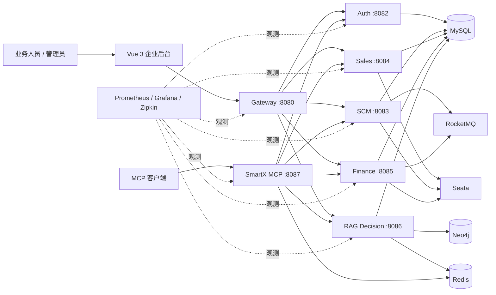

前端通过 Gateway 进入业务服务和智能服务。Auth 负责登录、JWT、角色、菜单和数据范围；SCM 聚合采购、库存、仓库、物料和成品；Sales 负责销售单据及履约状态；Finance 负责资金流水和提醒；RAG Decision 负责会话路由、混合检索、知识资料、图谱查询和模型调用；SmartX MCP 将这些能力包装成可治理的业务工具。

数据存储按照访问性质分工：

- MySQL 保存订单、库存、财务、权限和主数据等事务事实。
- Neo4j 保存适合关系探索的实体和边。
- Redis 保存缓存、短期状态以及工具/模型审计流。
- RocketMQ 处理提醒等异步业务。
- Seata 只覆盖明确的同步跨服务写链路。

Docker Compose 提供 MySQL、Neo4j、Redis、Nacos、Sentinel、RocketMQ、Seata、Zipkin、Prometheus、Alertmanager 和 Grafana 等本地依赖。Prometheus 当前覆盖 Gateway、Auth、SCM、Sales、Finance、RAG Decision 和 MCP 七个服务。

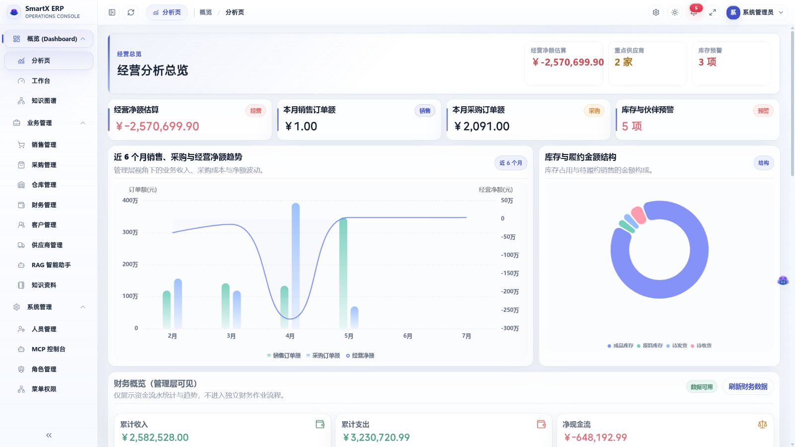

*图 1：经营分析工作台将销售、采购、库存和财务信息收拢到统一的管理视图。*

## 4. 业务域与数据模型

### 4.1 业务域划分

| 业务域 | 主要实体 | 关键状态 |
|---|---|---|
| 销售 | 销售单、销售明细、客户 | 草稿、审核、发货、付款、完成 |
| 采购 | 采购单、采购明细、供应商 | 草稿、审核、收货、付款、完成 |
| 库存 | 物料、库存、批次、仓库、仓位 | 可用、预警、锁定、过期 |
| 财务 | 资金流水、财务提醒 | 待处理、处理中、已完成、失败 |
| 主数据 | 客户、供应商、物料、成品 | 启用、停用、风险、分类 |
| 知识 | 文档、文档分片、向量和图谱实体 | 上传、切分、索引、召回 |
| 系统治理 | 用户、角色、菜单、数据范围、MCP Key | 启用、撤销、授权、审计 |

业务编号由统一编号生成逻辑产生，用于在 UI、RAG、MCP 和财务流水之间传递稳定的可读标识。状态字段表达单据生命周期，跨服务引用同时保留业务 ID 和业务编号，避免只依赖展示名称。

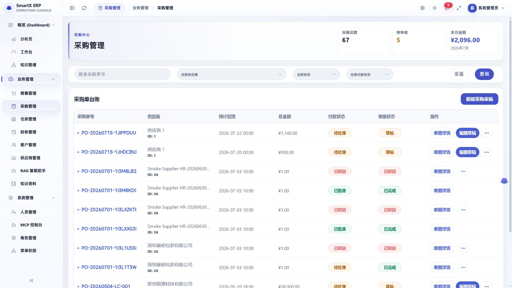

*图 2：采购台账同时呈现供应商、到货时间、付款状态和单据状态，并保留详情与草稿入口。*

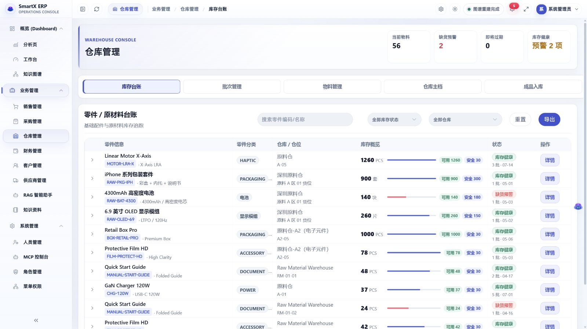

*图 3：库存台账按物料、仓位和安全库存展示当前库存状态，预警颜色保留业务语义。*

### 4.2 关系模型与图谱模型的分工

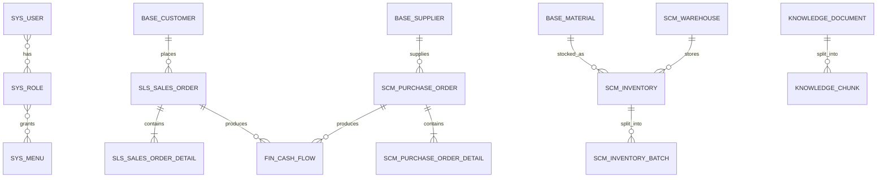

MySQL 负责“这条记录是什么、当前状态是什么、能否提交”的事务问题；Neo4j 负责“这些实体之间如何关联、从某个节点还能走到哪里”的关系问题。图谱不是主账数据库，图谱重建也不能覆盖事务数据的权威性。

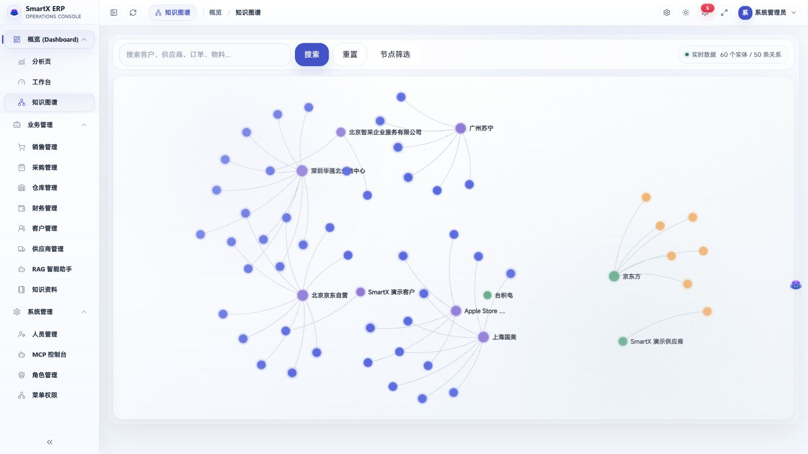

*图 4：知识图谱以客户、供应商和订单为节点展示业务关系，搜索结果仍需回到事务页面核对。*

## 5. RAG：从问题到可操作实体

### 5.1 检索链路

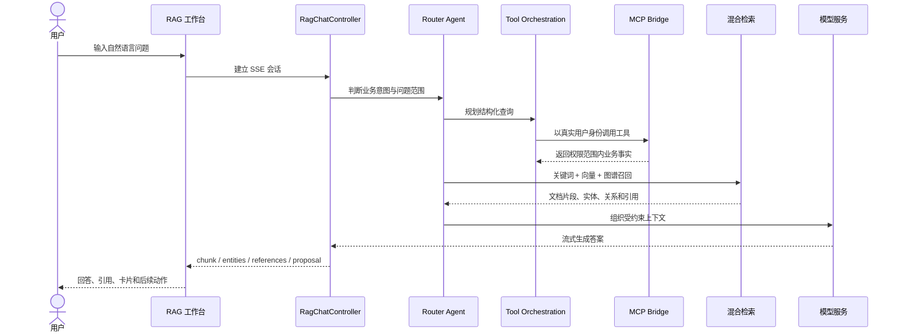

RAG 链路由 `RagChatController`、`RagPipelineService`、`RouterAgent`、`ToolOrchestrationService`、`AgentScopeExecutionService` 和 `McpAgentBridgeService` 等部分组成。它不把所有问题都送进向量库，而是先判断问题属于业务查询、知识问答、关系探索还是草稿提案，再选择合适的数据源。

### 5.2 混合检索

知识资料支持 PDF、DOCX 和 TXT 等文档的上传、抽取、分片、嵌入和召回预览。业务事实则通过结构化工具查询，关系问题通过 Neo4j 图谱补充。关键词召回保证编号和专有名词的精确性，向量召回处理语义相近表达，图谱召回处理多跳关系；需要时再使用 Rerank 调整候选顺序。

三种召回来源的职责不同：

- **关键词**适合销售单号、采购单号、物料编码等高精度标识。
- **向量**适合制度、说明书和自然语言相似语义。
- **图谱**适合“谁关联谁”“从这个实体还能找到哪些实体”等关系问题。

### 5.3 SSE 结构化事件

前端收到的不是一段不可拆分的文本，而是一组有语义的事件：

`start`、`chunk`、`entities`、`entityCards`、`references`、`proposal`、`draft`、`suggestions` 和 `done`。

这让前端可以分别处理文字、来源、实体卡片、草稿和建议动作。模型回答仍然可以以自然语言呈现，但关键业务对象已经被提取为结构化数据。

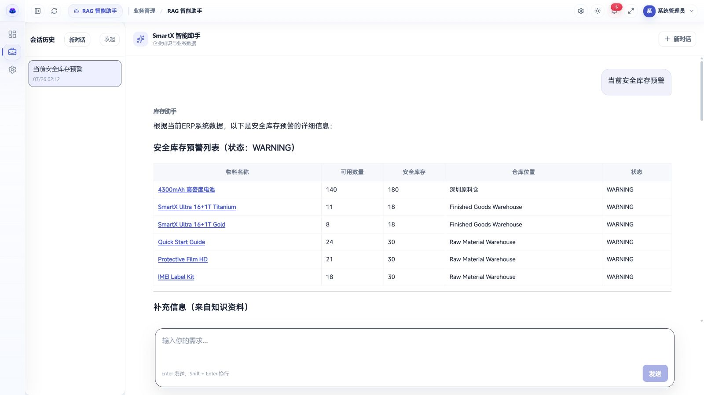

*图 5：RAG 回答同时包含自然语言解释、结构化库存表格和可继续操作的业务实体链接。*

### 5.4 实体路由契约

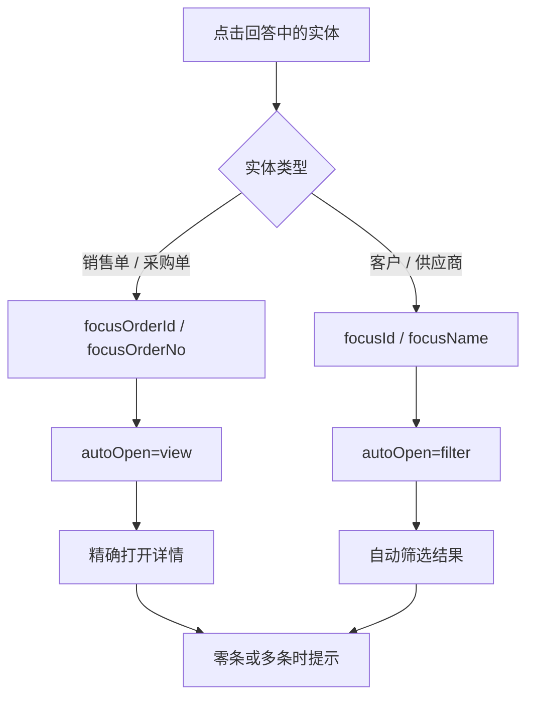

订单类实体通常拥有稳定的业务编号，可以在页面加载后打开详情；客户和供应商名称可能重复，因此优先进入带条件的筛选状态。任何匹配都不应该静默选择第一条记录：零条需要说明没有找到，多条需要交给用户继续确认。

### 5.5 写操作的边界

RAG 可以帮助用户准备销售或采购草稿，但正式写入仍然经过业务页面、用户确认和原有审核流程。工具层可以提供提案和草稿能力，但不能把自然语言直接等价为已经批准的业务单据。

## 6. MCP：把业务能力变成受治理的工具

### 6.1 工具目录

截至 2026-07-26 的归档材料，MCP 服务包含 28 个工具，覆盖：

- 销售：销售查询、销售草稿和相关履约能力。
- 采购：采购查询、采购草稿和相关履约能力。
- 库存：库存、批次和物料查询。
- 财务：资金流水、提醒和对账相关能力。
- 客商：客户与供应商查询。
- 物料与成品：物料、成品和入库相关能力。
- RAG/图谱：关系探索、知识检索和辅助查询。

MCP Server 独立运行，通过 `/mcp/sse` 和 `/mcp/message` 提供协议入口。管理员控制台集中展示工具目录、用户级 API Key、工具调用审计、模型调用审计和服务状态。

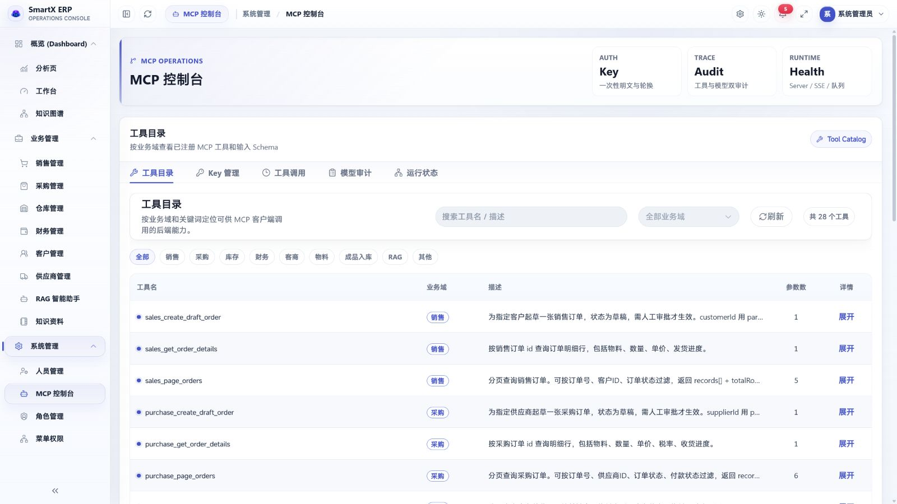

*图 6：MCP 控制台按业务域展示已注册工具、输入参数和用途，归档目录包含 28 个工具。*

### 6.2 Key 与真实用户身份

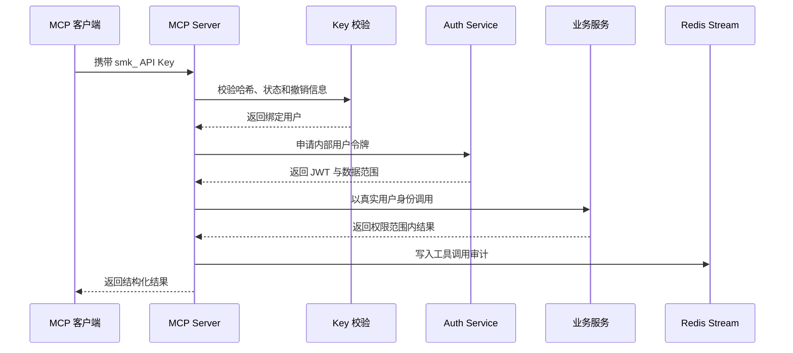

Key 只在创建时显示一次，数据库保存 SHA-256 哈希和可识别前缀。MCP 不使用固定的超级管理员身份访问所有数据，而是先把 Key 解析为真实用户，再向 Auth 服务申请内部令牌。下游服务继续执行原有的角色权限和部门数据范围。

### 6.3 双层审计

工具调用记录回答了“调用了哪个工具、由谁调用、访问了什么业务能力”；模型调用记录回答了“哪个模型、哪个会话、使用了哪些上下文、产生了什么结果”。两类记录分别写入 `mcp:invocation:log` 和 `rag:model:call:audit`，便于区分模型推理和业务执行。

## 7. 一致性、幂等与异步补偿

### 7.1 同步跨服务写入

销售发货会影响库存，销售付款和采购付款会影响财务流水。这类操作需要在一次业务动作内维持较强的一致性，因此指定链路使用 Seata AT 管理跨服务事务边界。

Seata 并没有覆盖所有业务，也没有被当作异步系统的替代品。它只用于确实需要同步确认的写入链路，避免把整个系统都耦合到一个大事务中。

### 7.2 异步业务

提醒、通知和部分派生事件采用 RocketMQ。SCM 侧通过 Outbox 记录消息状态：

`PENDING → SENT`，失败时进入 `FAILED` 并在重试边界内继续处理。

Finance 侧记录消费失败和死信状态，设置最大重试次数，并提供面向业务的排查入口。这样消息系统的失败不会被隐藏在日志里，而是能回到一个可观察的业务状态。

### 7.3 幂等与对账

销售/采购草稿工具、财务流水和消息消费分别采用业务级幂等控制。财务侧提供对账入口，用于处理重复消息、局部成功或人工补偿后的账实核对。

这里的取舍是：同步核心写链路优先保证原子性，异步派生链路优先保证可重试和可恢复，最终通过幂等和对账把局部失败控制在可处理范围内。

## 8. 权限与安全边界

系统的权限边界由多层组成：

1. **JWT 认证**：Auth 服务负责登录和令牌签发，关键配置缺失时快速失败。
2. **RBAC**：用户、角色和菜单控制功能可见性与操作权限。
3. **部门数据范围**：下游服务继续使用统一的数据范围信息限制可见记录。
4. **网关身份清理**：Gateway 不信任客户端直接提交的内部用户身份头。
5. **内部 HMAC**：敏感服务间调用绑定调用方、时间戳、方法和路径，时间窗口约为正负 5 分钟。
6. **MCP Key 撤销**：Key 支持缓存和撤销，数据库不保存可直接恢复的明文。

当前 HMAC 方案可以抵御简单身份伪造和过期请求，但没有把 nonce、mTLS、密钥轮换和长期合规归档包装成已经完成的能力。这些属于生产化阶段需要继续补齐的安全设施。

## 9. 前端工作台与统一交互

前端使用 Vue 3、Vite、Pinia、Vue Router、Element Plus、ECharts、D3 和 force-graph，覆盖经营分析、销售、采购、库存、财务、知识图谱、RAG、知识资料、MCP 和系统管理。

复杂后台的体验问题不只是颜色。页面需要同时解决：

- 多页面筛选栏的字体、间距、圆角、按钮位置和输入即筛选。
- 表格、详情面板、空态、错误态、禁用态和状态色的一致性。
- RAG 实体卡片和业务页面之间的路由参数契约。
- 图谱节点搜索、筛选、重建和暗色模式下的可读性。
- AgentDock、详情抽屉和流式回答在不同桌面宽度下的稳定布局。

因此 UI 优化最终沉淀为共享 Hero、筛选表面和主题变量，而不是继续对每个页面做孤立的像素修补。业务成功、警告、危险和完成状态仍保留语义颜色，视觉统一不等于抹平业务含义。

## 10. 可观测性与验证

### 10.1 运行观测

Nacos 和 Sentinel 负责服务注册、配置与流量治理；Zipkin 负责调用链；Prometheus 采集 8080–8087 服务指标；Grafana 提供看板；Alertmanager 负责告警分发。RocketMQ、Outbox、财务流水和 MCP 审计还保留业务层状态，避免只看基础设施指标而看不到业务失败。

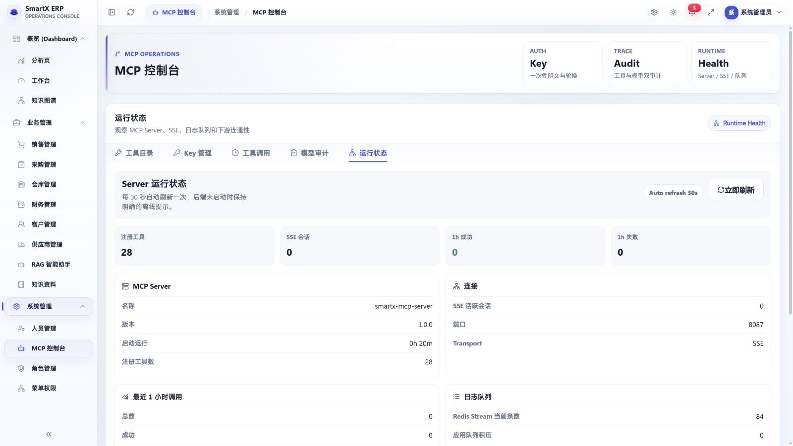

*图 7：运行状态页集中展示 MCP Server、SSE、日志队列和下游服务连通性。*

### 10.2 2026-07-26 归档可核对结果

该日期的归档材料记录了以下结果：

- 源码包含 7 个 Spring Boot 服务。
- MCP 目录包含 28 个工具。
- 前端 Node 测试为 176 / 176 通过。
- Vite 生产构建成功，转换 4,979 个模块。
- Maven Reactor 20 个模块构建成功；该次构建明确使用 `-DskipTests`，因此只作为构建证据。

### 10.3 仍然缺少的证据

当前没有统一的 RAG 离线评测集、P95/P99 延迟、并发用户数、真实数据规模、模型成本、消息积压恢复时间或生产 SLA。因此这些指标不会在项目页面中被虚构出来。

## 11. 技术取舍

### 为什么同时使用 MySQL 和 Neo4j

ERP 主账需要事务、约束和稳定的状态流转，适合放在 MySQL；实体关系和多跳路径探索适合 Neo4j。两者分工后，事务写入与关系查询各自保持清晰边界。

### 为什么同时使用 RAG 和 MCP

文档和制度资料适合通过向量与关键词检索，实时订单、库存和财务事实适合通过结构化业务工具查询。RAG 负责组织上下文和回答，MCP 负责提供受治理的业务能力，两者不是相互替代关系。

### 为什么不让模型直接写入正式单据

模型输出具有概率性，业务单据具有确定性。让模型负责理解、检索和生成提案，让用户负责审核和提交，可以把自然语言的不确定性隔离在正式业务状态之外。

### 为什么采用 Docker Compose

当前目标是完整本地集成和演示，需要同时启动多个服务和中间件。Docker Compose 降低了开发环境搭建成本，但它不等于 Kubernetes 生产编排，资源、备份、滚动升级和灾备仍需要单独设计。

## 12. 结论与后续方向

SmartX EKG 的核心价值不在于把 ERP 加上一个聊天窗口，而在于建立一条从自然语言到业务事实、从业务事实到结构化实体、从实体到页面操作、从工具调用到权限审计的完整链路。

这条链路要求系统同时处理：

- 传统 ERP 的事务数据和状态生命周期。
- Neo4j 的关系表达和图谱探索。
- RAG 的多源召回、引用和流式输出。
- MCP 的工具目录、身份透传和调用审计。
- Seata、RocketMQ、Outbox、幂等和对账。
- JWT、RBAC、部门数据范围、HMAC 和 Key 撤销。
- 多页面企业后台的视觉统一与暗色主题。

后续最值得继续推进的方向包括：建立固定 RAG 评测集，补充后端完整测试和故障演练，完善 MCP 审计长期归档，引入 nonce/mTLS/密钥轮换，建立性能和模型成本基线，并继续拆分复杂前端页面。

## 说明边界

- 项目截图、订单、客商、库存和财务信息均为虚拟数据。
- 当前页面展示的是本地开发与演示系统，不声称已经生产上线。
- 当前没有可公开的真实用户数、客户数、并发量、性能提升比例或业务收益。
- “系统支持某项能力”指当前源码、配置或本地验证中存在对应实现，不等同于已经完成商业化运营。

## 系列导读

十篇工程复盘按项目推进过程分成四个阶段。建议顺序阅读，也可以从当前遇到的问题直接进入对应阶段：

1. **建立边界**：[把后台做得更像系统](../../posts/smartx-erp-frontend-retrospective/) → [MCP 的重点不是工具列表](../../posts/smartx-erp-mcp-boundary/) → [让 AI 回答能够被追踪](../../posts/smartx-erp-agent-audit/)。这一阶段先解决页面规则、工具契约、身份和审计。
2. **接通业务链路**：[微服务启动失败，真正缺的是可复现环境](../../posts/smartx-erp-reproducible-environment/) → [让 RAG 回答真正回到业务页面](../../posts/smartx-erp-rag-entity-routing/) → [Seata、Outbox 与 RocketMQ 如何分工](../../posts/smartx-erp-consistency-strategy/)。这一阶段关注运行环境、实体路由和一致性。
3. **处理真实复杂度**：[一次 StackOverflowError 背后的身份递归](../../posts/smartx-erp-mcp-recursive-auth/) → [从页面补丁到 Aeria 组件体系](../../posts/smartx-erp-aeria-system/) → [自动化通过为什么不等于验收完成](../../posts/smartx-erp-validation-evidence/)。这一阶段记录故障、组件沉淀和验证证据。
4. **完成工程收尾**：[一个毕业设计如何完成工程收尾](../../posts/smartx-erp-graduation-closeout/)。最后统一事实、安全、可靠性、智能能力、前端与交付边界。

[查看完整 SmartX ERP 工程复盘系列](../../series/SmartX%20ERP%20工程复盘/)
